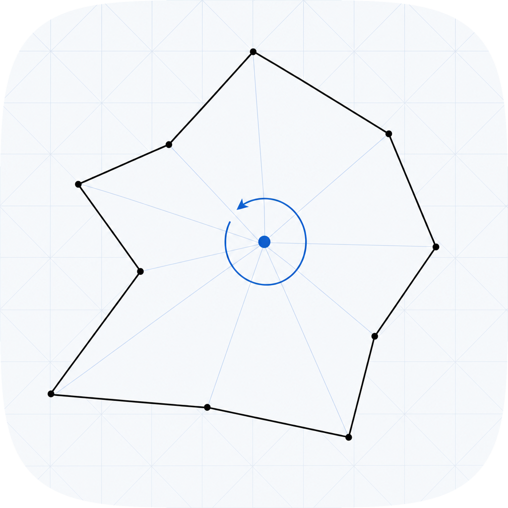

# winding-number

<p align="center">
  
</p>

[](https://github.com/amaar-mc/winding-number/actions/workflows/ci.yml)
[](./LICENSE)

Winding number and point-in-polygon for arbitrary (non-convex, self-intersecting) polygons.
Pure Python, zero dependencies.

## What is the winding number?

The **winding number** of a closed polygon around a point is the integer count of how many
times the polygon winds around that point. A CCW polygon around an interior point has
winding number +1; a CW polygon gives -1; an exterior point gives 0.

This is the basis of the **nonzero rule**: a point is inside iff `winding_number != 0`.

## Two fill rules

This library implements both standard fill rules:

**Nonzero rule** (`point_in_polygon`): inside iff `winding_number != 0`. Correct for
non-convex and self-intersecting polygons; all regions with a non-zero winding count
are considered inside.

**Even-odd rule** (`point_in_polygon_even_odd`): inside iff `crossing_number` is odd.
Counts how many times a ray from the point crosses the polygon boundary; an odd count
means inside. The two rules agree for simple (non-self-intersecting) polygons and diverge
for self-intersecting ones.

### Pentagram example

The canonical case where the rules disagree is a five-pointed star (pentagram) traced as
the self-intersecting 5-vertex path (outer tips connected in skip-one order):

```python
import math
from winding_number import winding_number, point_in_polygon, crossing_number, point_in_polygon_even_odd

n = 5
circle_pts = [
    (math.cos(math.radians(90 - 72 * i)), math.sin(math.radians(90 - 72 * i)))
    for i in range(n)
]
pentagram = [circle_pts[i % n] for i in [0, 2, 4, 1, 3]]

center = (0.0, 0.0)

winding_number(center, pentagram)               # -2  (wound twice, CW)
point_in_polygon(center, pentagram)             # True   (nonzero rule: inside)
crossing_number(center, pentagram)              # 2   (two crossings, even)
point_in_polygon_even_odd(center, pentagram)    # False  (even-odd rule: outside)
```

The central region is wound around twice, so the nonzero rule treats it as inside.
The even-odd rule ignores winding direction and depth: two crossings is even, so outside.

## Why zero-dependency vs. shapely or matplotlib?

The correct alternatives require heavy C extensions:

- `shapely.geometry.Point.within(polygon)` requires shapely, which depends on GEOS (a C/C++ library).
- `matplotlib.path.Path.contains_point` pulls in all of matplotlib (rendering, fonts, backends).

This library implements Sunday's winding-number algorithm in pure Python with zero runtime
dependencies. No compilation, no GEOS, no plotting overhead.

## Install

```sh
pip install winding-number
```

> PyPI release pending. Install from source in the meantime:
> ```sh
> git clone https://github.com/amaar-mc/winding-number
> cd winding-number
> pip install -e .
> ```

## Quick start

```python
from winding_number import winding_number, point_in_polygon, crossing_number, point_in_polygon_even_odd, signed_area, orientation, is_convex

# CCW unit square.
square = [(1, -1), (1, 1), (-1, 1), (-1, -1)]

winding_number((0, 0), square)      # 1  (inside, CCW)
winding_number((2, 0), square)      # 0  (outside)
point_in_polygon((0, 0), square)    # True
point_in_polygon((2, 0), square)    # False

signed_area(square)                 # 4.0  (positive = CCW)
orientation(square)                 # "CCW"
is_convex(square)                   # True

# Non-convex L-shape.
l_shape = [(0,0),(2,0),(2,1),(1,1),(1,2),(0,2)]
is_convex(l_shape)                  # False
point_in_polygon((1.0, 0.5), l_shape)  # True  (inside the bottom bar)
point_in_polygon((1.5, 1.5), l_shape) # False (the notch)
```

## API

| Function | Description |
|---|---|
| `winding_number(point, polygon)` | Signed winding number (Sunday's algorithm with isLeft) |
| `point_in_polygon(point, polygon)` | True iff `winding_number != 0` (nonzero rule) |
| `crossing_number(point, polygon)` | Number of rightward ray crossings (PNPOLY convention) |
| `point_in_polygon_even_odd(point, polygon)` | True iff `crossing_number` is odd (even-odd rule) |
| `signed_area(polygon)` | Shoelace formula; positive = CCW, negative = CW |
| `orientation(polygon)` | "CCW" or "CW"; raises ValueError on degenerate zero-area polygon |
| `is_convex(polygon)` | True iff all edge-pair cross products share the same sign |

A `point` is `tuple[float, float]` and a `polygon` is `Sequence[tuple[float, float]]`.
All functions raise `ValueError` if the polygon has fewer than 3 vertices.

### On-edge convention

**Nonzero rule**: a point exactly on a non-horizontal polygon edge is counted as inside
(`winding_number` returns +/-1). A point on a horizontal edge is counted as outside
(winding number 0).

**Even-odd rule**: the crossing test uses a strict `<` for the crossing x-coordinate,
so a point that lies exactly on a non-horizontal edge (where the ray x-coordinate equals
the crossing x) is counted as outside. Points on horizontal edges are outside (horizontal
edges are skipped). The two algorithms may therefore disagree at exact boundary points;
they agree at all strictly interior and strictly exterior points of simple polygons.

Both conventions are deterministic and require no epsilon. See
[docs/architecture.md](docs/architecture.md) for the full derivation.

## License

MIT. Copyright (c) 2026 Amaar Chughtai.
